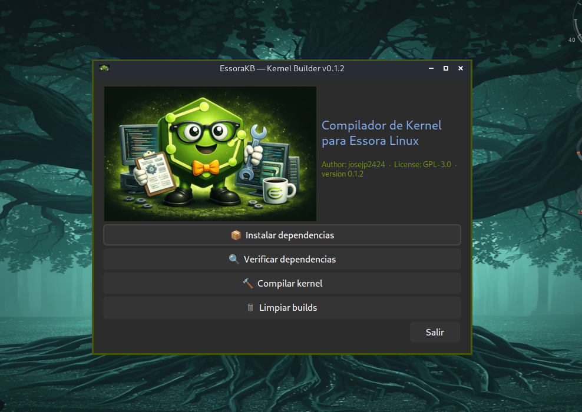

<div align="center">



# EssoraKB

**Graphical Kernel Builder for Essora Linux**


</div>

---

## Overview

EssoraKB is a graphical frontend for compiling custom Linux kernels on Essora Linux, a Devuan-based distribution using OpenRC. Instead of running dozens of commands manually, EssoraKB guides you through the entire process — from installing build dependencies to generating ready-to-install `.deb` packages — through a clean interface built with YAD.

The program includes pre-configured kernel profiles for x86_64, supports ccache for faster recompilation, and generates all four packages that a Debian-compatible system needs.

---

## Features

- One-click installation of all 60+ build dependencies
- Pre-configured `DOTconfig` profiles for stable and RC kernel versions
- Two compilation modes: fully automatic or interactive via `menuconfig`
- ccache integration for significantly faster recompilation
- Generates `linux-image`, `linux-headers`, `linux-kbuild` and `linux-libc-dev` packages
- Built-in YAD authentication dialog — no external gksu required
- Multilingual interface with automatic detection via `$LANG`
- Themed xterm terminal with Catppuccin Mocha colors

---

## Supported Languages

`en` `es` `fr` `de` `it` `pt` `ar` `ca` `hu` `ru` `ja` `zh`

Language is detected automatically from the `$LANG` environment variable.

---

## Requirements

| Package | Purpose |
|---------|---------|
| `yad` | Graphical interface |
| `xterm` | Terminal output |
| `xdotool` | Window management |

All kernel build dependencies are installed by the program itself via the **Install dependencies** action.

---

## Installation

Download the `.deb` package from [SourceForge](https://sourceforge.net/projects/essora/files/Eos/packages/essorakb_0.1.2_amd64.deb) and install it:

```bash
sudo dpkg -i EssoraKB_0.1.2_amd64.deb
sudo apt-get install -f
```

The application will be available in your menu under **System** or launch it directly:

```bash
/opt/EssoraKB/essorakb-gui.sh
```

---

## Usage

### 1. Install dependencies

Click **Install dependencies**. A terminal window opens and installs all required packages across ten groups: kernel build tools, compilers, ccache, Python, GTK and Qt development libraries, and Debian packaging tools. This step only needs to be done once.

Use **Check dependencies** to verify what is already installed without modifying the system.

### 2. Build kernel

Click **Build kernel** and configure the following options:

| Option | Description |
|--------|-------------|
| Kernel configuration | Select a `DOTconfig` profile from the dropdown |
| Parallel jobs | Number of CPU threads (0 = auto via `nproc`) |
| Automatic mode | See below |
| Force re-download | Re-download the source tarball even if it exists |

### 3. Automatic mode vs interactive mode

**Automatic mode enabled**
> The build runs completely unattended. `make olddefconfig` is applied to the selected profile and compilation starts immediately with no prompts.

**Automatic mode disabled**
> `make menuconfig` opens before compiling. You can browse and modify every option in the selected `DOTconfig` — enable or disable drivers, tweak the scheduler, add module support, change security settings. Compilation begins after you save and exit.

### 4. Output packages

When compilation finishes, all generated `.deb` packages are saved to:

```
/opt/EssoraKB/builds/out/<kernel-version>/
```

To install the compiled kernel:

```bash
cd /opt/EssoraKB/builds/out/<kernel-version>/

sudo dpkg -i linux-image-*_amd64.deb \
             linux-headers-*_amd64.deb \
             linux-kbuild-*_amd64.deb \
             linux-libc-dev_amd64.deb

sudo update-grub
```

### 5. Clean builds

Use **Clean builds** to delete the `builds/` directory and the build log, freeing disk space after a successful installation.

---

## File Structure

```
/opt/EssoraKB/
├── essorakb-gui.sh          # Main GUI launcher
├── build.sh                 # Kernel compilation script
├── install-deps.sh          # Dependency installer
├── EssoraKB.png             # Application icon
├── configs_x86_64/          # Pre-configured DOTconfig profiles
│   ├── DOTconfig-6.12.57-x86_64
│   ├── DOTconfig-6.12.59-x86_64
│   ├── DOTconfig-6.19.12-x86_64
│   └── DOTconfig-7.0-rc7-x86_64
└── builds/                  # Output directory (created at build time)
    └── out/
        └── <kernel-version>/
            ├── linux-image-*_amd64.deb
            ├── linux-headers-*_amd64.deb
            ├── linux-kbuild-*_amd64.deb
            └── linux-libc-dev_amd64.deb
```

---

## Known Issues

- If `update-initramfs` fails with a `live-boot` hook error after installing the compiled kernel, disable the orphaned hook and regenerate the initramfs manually:

```bash
sudo mv /usr/share/initramfs-tools/hooks/live \
        /usr/share/initramfs-tools/hooks/live.disabled

sudo update-initramfs -c -k <kernel-version>
sudo update-grub
```

---

## License

This program is free software: you can redistribute it and/or modify it under the terms of the [GNU General Public License v3.0](https://www.gnu.org/licenses/gpl-3.0.html).

---

## Author

**josejp2424** — Essora Linux Project

- SourceForge: https://sourceforge.net/projects/essora/
- GitHub: https://github.com/josejp2424
